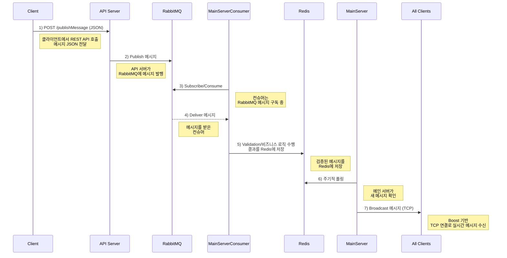
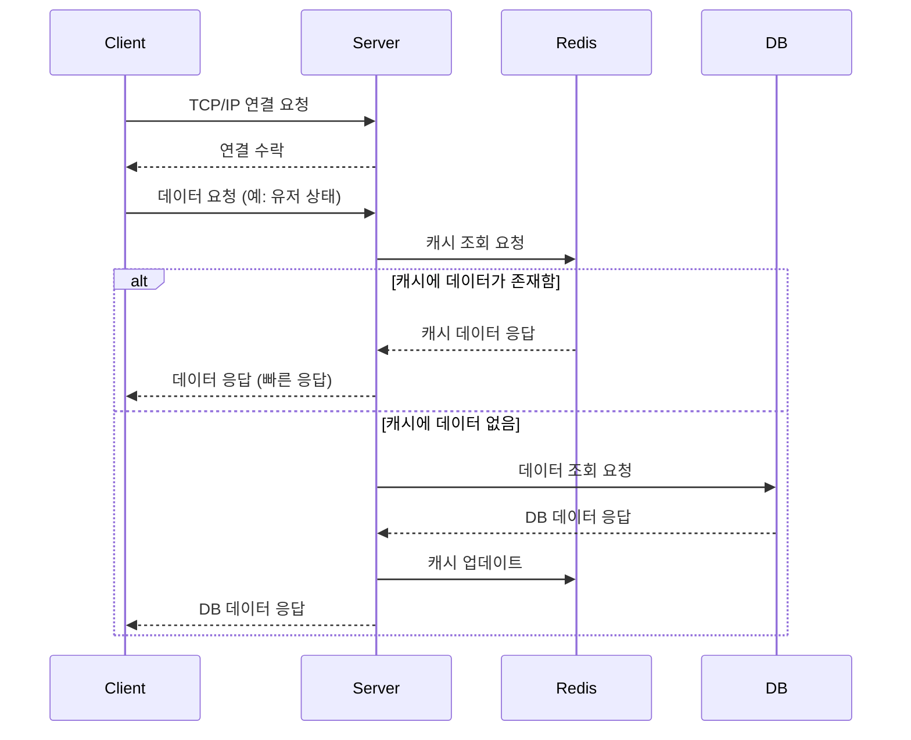
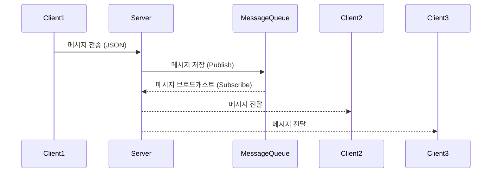
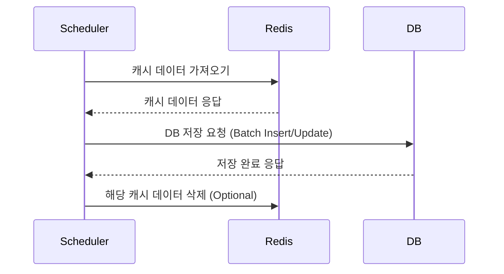
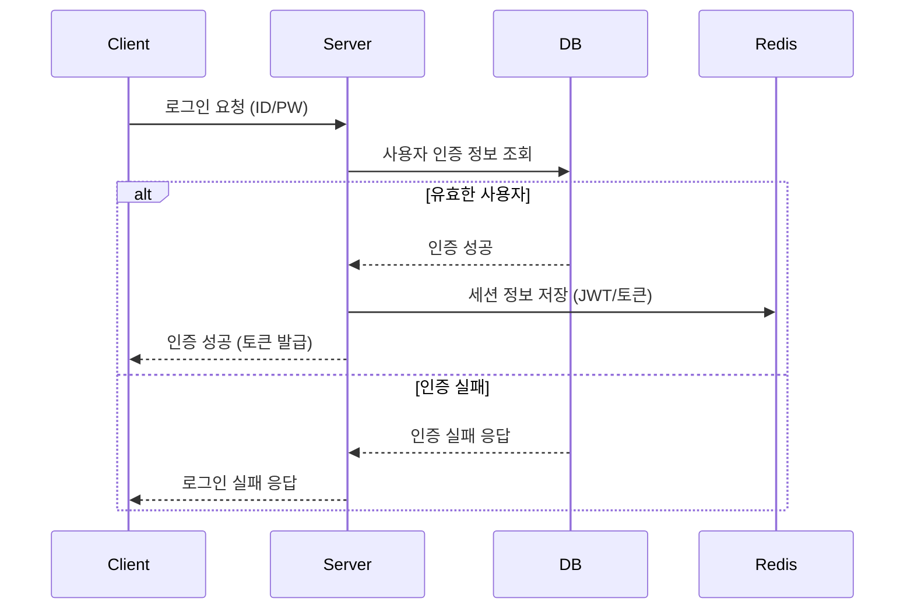
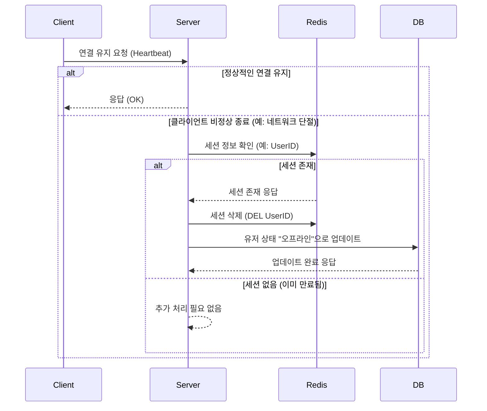

# RealTimeMessageChat

**RealTimeMessageChat**은 **C++23**, **Boost.Asio**, **RabbitMQ(AMQP)**, **Redis**, **PostgreSQL**을 활용한 고성능 실시간 메시징 시스템입니다. 멀티 프로세스 아키텍처를 통해 메시지가 RabbitMQ를 거쳐 메인 서버로 전달되고, 검증 후 연결된 모든 TCP 클라이언트에 브로드캐스트됩니다.

## 목차
- [핵심 특징](#핵심-특징)
- [시스템 아키텍처](#시스템-아키텍처)
- [프로젝트 구조](#프로젝트-구조)
- [빌드 및 실행](#빌드-및-실행)
  - [로컬 빌드](#로컬-빌드-macoslinux)
  - [Docker 빌드 및 실행](#docker-빌드-및-실행)
- [설정 파일](#설정-파일)
- [주요 설계 패턴](#주요-설계-패턴)
- [개발 가이드](#개발-가이드)

---

## 핵심 특징

1. **고성능 네트워킹**: Boost.Asio 기반 비동기 I/O, 멀티스레드 ThreadPool을 통한 동시성 처리
2. **메시지 브로커 연동**: RabbitMQ(AMQP)를 통한 Publish/Subscribe 파이프라인
3. **캐싱 및 저장소**: Redis를 활용한 저지연 캐싱, PostgreSQL을 통한 데이터 영속화
4. **확장 가능한 구조**: 멀티 프로세스/멀티 스레드 아키텍처, 모듈화된 컴포넌트 설계
5. **보안**: SSL/TLS 지원, 암호화 모드 옵션
6. **Docker 지원**: 멀티 스테이지 빌드, docker-compose를 통한 간편한 배포

---

## 시스템 아키텍처

### 전체 아키텍처 개요

```
┌─────────────┐     ┌──────────────┐     ┌─────────────────┐
│   UserClient│────▶│  API Server  │────▶│    RabbitMQ     │
└─────────────┘     └──────────────┘     └────────┬────────┘
                                                   │
                                                   │ Subscribe
                                                   │
                         ┌─────────────────────────▼─────────┐
                         │   MainServerConsumer              │
                         │   - 메시지 검증                    │
                         │   - 비즈니스 로직 수행             │
                         │   - Redis에 결과 저장              │
                         └─────────────────┬─────────────────┘
                                           │
                                           │ Redis Sync
                                           │
                         ┌─────────────────▼─────────────────┐
                         │       MainServer                  │
                         │   - TCP 서버 (Boost.Asio)         │
                         │   - Redis 폴링                    │
                         │   - 클라이언트 브로드캐스트        │
                         └─────────────┬───────────────────┬─┘
                                       │                   │
                         ┌─────────────▼──┐   ┌───────────▼─────────┐
                         │  TCP Client 1  │   │  TCP Client N       │
                         └────────────────┘   └─────────────────────┘
```

### 컴포넌트 설명

#### 1. **MainServer**
- **역할**: TCP 서버로 동작하며 클라이언트 연결을 관리
- **기술**: Boost.Asio 기반 `NetworkServer` (cpp_tool_kit)
- **기능**:
  - 클라이언트 인증 및 세션 관리
  - Redis에서 메시지 폴링 및 브로드캐스트
  - 주기적인 Redis 동기화

#### 2. **MainServerConsumer**
- **역할**: RabbitMQ 메시지 소비 및 비즈니스 로직 처리
- **기술**: `WorkQueueConsume` (cpp_tool_kit)
- **기능**:
  - RabbitMQ 큐 구독
  - 메시지 검증 및 비즈니스 로직 수행
  - Redis에 처리 결과 저장

#### 3. **UserClient**
- **역할**: TCP 클라이언트 애플리케이션
- **기술**: `NetworkClient` (cpp_tool_kit)
- **기능**:
  - MainServer와 TCP 연결
  - 브로드캐스트 메시지 수신
  - 사용자 상태 업데이트 전송

#### 4. **CommonModule**
- **역할**: 서버와 클라이언트 간 공유 로직
- **구성**:
  - `ServerMessageParsing/Execute`: 서버 측 메시지 핸들러
  - `ClientMessageParsing/Execute`: 클라이언트 측 메시지 핸들러
  - `ModuleHeader.hpp`: 콜백 함수 타입 정의

#### 5. **cpp_tool_kit**
- **역할**: 재사용 가능한 C++ 유틸리티 라이브러리 (서브모듈)
- **구성**:
  - `Network/`: TCP 네트워킹 (`NetworkServer`, `NetworkClient`, `NetworkSession`)
  - `Redis/`: Redis 클라이언트 (`RedisClient`, `RedisConnector`)
  - `RabbitMQ/`: AMQP 메시지 큐 (`WorkQueueConsume`)
  - `ThreadPool/`: 스레드 풀 구현
  - `Utilities/`: Logger, ArgumentParser 등

---

## 프로젝트 구조

```
RealTimeMessageChat/
├── MainServer/                  # TCP 서버 구현
│   ├── main_server_configurations.json
│   └── MainServer.cpp
├── MainServerConsumer/          # RabbitMQ 컨슈머
│   ├── main_server_consumer_configurations.json
│   └── MainServerConsumer.cpp
├── UserClient/                  # TCP 클라이언트
│   ├── user_client_configurations.json
│   └── UserClient.cpp
├── CommonModule/                # 공통 메시지 처리 로직
│   ├── ServerMessageParsing/
│   ├── ClientMessageParsing/
│   └── ModuleHeader.hpp
├── .cpp_tool_kit/              # 재사용 가능한 C++ 라이브러리 (서브모듈)
│   ├── Network/
│   ├── Redis/
│   ├── RabbitMQ/
│   ├── ThreadPool/
│   └── Utilities/
├── docker/                      # Docker 관련 파일
│   ├── Dockerfile
│   ├── docker-compose.yml
│   ├── docker-compose.sh
│   └── config/                  # Docker용 설정 파일
├── vcpkg.json                   # vcpkg 의존성 정의
├── CMakeLists.txt              # 루트 CMake 설정
└── README.md
```

---

## 빌드 및 실행

### 사전 준비

#### 공통 요구사항
- **CMake**: 3.18 이상
- **빌드 도구**: Ninja 또는 Make
- **컴파일러**:
  - macOS: Xcode toolchain (Clang)
  - Linux: gcc-13 이상
  - C++23 표준 지원 필수

#### vcpkg 설정
프로젝트는 [vcpkg](https://github.com/microsoft/vcpkg)를 사용하여 의존성을 관리합니다.

```bash
# vcpkg 설치 (홈 디렉토리에 설치하는 예시)
cd ~
git clone https://github.com/microsoft/vcpkg.git
cd vcpkg
./bootstrap-vcpkg.sh
```

**주요 의존성** (`vcpkg.json` 참조):
- `boost-asio`, `boost-json`, `boost-system`, `boost-filesystem`, `boost-process`
- `librabbitmq`: RabbitMQ AMQP 클라이언트
- `redis-plus-plus`: Redis 클라이언트 (C++17, TLS 지원)
- `libpq`: PostgreSQL 클라이언트
- `cryptopp`: 암호화 라이브러리
- `lz4`: 압축 라이브러리
- `gtest`: 테스트 프레임워크

---

### 로컬 빌드 (macOS/Linux)

#### 자동 빌드 스크립트 사용

```bash
# 프로젝트 루트에서 실행
./build.sh
```

빌드 결과물:
- **실행 파일**: `build/out/MainServer`, `build/out/UserClient`, `build/out/MainServerConsumer`
- **라이브러리**: `build/lib/`

#### 수동 빌드

```bash
# 빌드 디렉토리 생성 및 초기화
rm -rf build
mkdir build
cd build

# CMake 구성 (vcpkg 경로를 실제 설치 위치로 변경)
cmake .. \
  -DCMAKE_TOOLCHAIN_FILE="$HOME/vcpkg/scripts/buildsystems/vcpkg.cmake" \
  -DCMAKE_BUILD_TYPE=Release \
  -DBUILD_SHARED_LIBS=OFF

# 빌드 실행
cmake --build . --config Release --parallel
```

**주의사항**:
- `build.sh`는 vcpkg가 `~/vcpkg`에 설치되어 있다고 가정합니다. 다른 위치에 설치했다면 스크립트나 CMake 명령의 경로를 수정하세요.
- RabbitMQ SSL/TLS 지원이 필요한 경우, librabbitmq를 SSL 옵션을 활성화하여 빌드해야 합니다.

---

### Docker 빌드 및 실행

Docker를 사용하면 의존성 관리와 배포가 간편합니다. 프로젝트는 멀티 스테이지 Dockerfile과 docker-compose를 제공합니다.

#### Docker 구조

**Dockerfile 스테이지**:
1. **builder**: Ubuntu 24.04 기반, vcpkg 설치 및 프로젝트 빌드
   - gcc-13, CMake, Ninja 설치
   - vcpkg를 통한 의존성 자동 설치
   - 아키텍처 자동 감지 (x64-linux, arm64-linux)
2. **runtime**: 최소한의 런타임 환경
   - 빌드된 바이너리만 포함
   - 설정 파일 및 로그 디렉토리 구성

**docker-compose 서비스**:
- `rabbitmq`: RabbitMQ 메시지 브로커 (포트: 5672, 관리 UI: 15672)
- `redis`: Redis 캐시 서버 (포트: 6379)
- `mainserver`: MainServer TCP 서버 (포트: 9876)
- `mainserver-consumer`: MainServerConsumer 백그라운드 프로세스

#### 빌드 및 실행

```bash
# docker 디렉토리로 이동
cd docker

# 전체 스택 빌드 및 실행 (권장)
./docker-compose.sh
```

`docker-compose.sh`는 다음을 수행합니다:
1. Docker 이미지 빌드 (멀티 스테이지)
2. RabbitMQ와 Redis 컨테이너 시작 및 헬스체크 대기
3. MainServer와 MainServerConsumer 컨테이너 시작
4. 모든 서비스가 정상적으로 시작될 때까지 대기

#### 개별 명령어

```bash
# 이미지 빌드만 수행
docker build --target builder -f docker/Dockerfile ..

# 특정 아키텍처 빌드 (크로스 컴파일)
docker build --target builder \
  --build-arg VCPKG_TRIPLET=arm64-linux \
  -f docker/Dockerfile ..

# 서비스 시작
docker compose -f docker/docker-compose.yml up -d

# 로그 확인
docker compose -f docker/docker-compose.yml logs -f mainserver
docker compose -f docker/docker-compose.yml logs -f mainserver-consumer

# 서비스 중지
docker compose -f docker/docker-compose.yml down

# 서비스 상태 확인
docker compose -f docker/docker-compose.yml ps
```

#### 설정 파일 및 볼륨

Docker 컨테이너는 다음 볼륨을 마운트합니다:
- **설정 파일** (읽기 전용):
  - `./config/main_server_configurations.json` → `/opt/app/bin/`
  - `./config/main_server_consumer_configurations.json` → `/opt/app/bin/`
- **로그 디렉토리**:
  - `./logs/mainserver/` → `/opt/app/logs/`
  - `./logs/consumer/` → `/opt/app/logs/`

설정을 변경하려면 `docker/config/` 디렉토리의 JSON 파일을 수정하고 컨테이너를 재시작하세요.

#### 디버깅

```bash
# 컨테이너 내부 접근
docker exec -it mainserver /bin/bash

# RabbitMQ, Redis 연결 확인 (컨테이너 내부에서)
nc -zv rabbitmq 5672
nc -zv redis 6379

# 로그 실시간 모니터링
docker compose -f docker/docker-compose.yml logs -f
```

---

## 설정 파일

각 컴포넌트는 JSON 형식의 설정 파일을 사용합니다.

### MainServer 설정 (`main_server_configurations.json`)

```json
{
  "server_ip": "0.0.0.0",
  "server_port": 9876,
  "redis_host": "redis",
  "redis_port": 6379,
  "redis_db_user_status_index": 0,
  "redis_db_global_message_index": 1,
  "redis_ttl_sec": 3600,
  "use_redis": true,
  "use_redis_tls": false,
  "high_priority_count": 4,
  "normal_priority_count": 8,
  "low_priority_count": 2,
  "buffer_size": 8192,
  "encrypt_mode": false,
  "use_ssl": false,
  "log_root_path": "/opt/app/logs"
}
```

**주요 파라미터**:
- `server_ip`, `server_port`: TCP 서버 리스닝 주소
- `redis_host`, `redis_port`: Redis 연결 정보
- `redis_db_*_index`: Redis 데이터베이스 인덱스 (용도별 분리)
- `redis_ttl_sec`: 캐시 만료 시간 (초)
- `high/normal/low_priority_count`: 스레드 풀 워커 수 (우선순위별)
- `buffer_size`: TCP 버퍼 크기
- `encrypt_mode`, `use_ssl`: 암호화 및 SSL/TLS 활성화

### MainServerConsumer 설정 (`main_server_consumer_configurations.json`)

```json
{
  "rabbitmq_host": "rabbitmq",
  "rabbitmq_port": 5672,
  "rabbitmq_user": "guest",
  "rabbitmq_password": "guest",
  "consume_queue_name": "message_queue",
  "redis_host": "redis",
  "redis_port": 6379,
  "high_priority_count": 2,
  "normal_priority_count": 4,
  "low_priority_count": 1,
  "log_root_path": "/opt/app/logs"
}
```

### UserClient 설정 (`user_client_configurations.json`)

```json
{
  "server_ip": "localhost",
  "server_port": 9876,
  "reconnect_interval_sec": 5,
  "heartbeat_interval_sec": 30
}
```

---

## 주요 설계 패턴

### 메시지 플로우



### 콜백 기반 메시지 핸들링

`CommonModule/ModuleHeader.hpp`에서 정의된 콜백 맵:

```cpp
// 서버 메시지 실행 콜백
using server_message_execute_callback =
  std::function<std::tuple<bool, std::optional<std::string>>(const std::string&)>;

// 클라이언트 메시지 파싱 콜백
using client_message_parsing_callback =
  std::function<std::tuple<bool, std::optional<std::string>>(
    const std::string& id,
    const std::string& sub_id,
    const std::string& command,
    const std::string& message
  )>;
```

메시지 핸들러는 `std::map<std::string, callback>`에 등록되며, 커맨드 문자열을 키로 사용합니다.

### Redis 사용 패턴

- **사용자 상태 캐시**: `redis_db_user_status_index` - 온라인/오프라인 상태 저장
- **글로벌 메시지**: `redis_db_global_message_index` - 브로드캐스트용 메시지 저장
- **TTL**: `redis_ttl_sec`를 통한 자동 만료

### 스레드 풀

각 컴포넌트는 3개의 우선순위 큐를 가진 스레드 풀을 생성합니다:
- **High priority**: 중요한 작업 (연결 핸들링)
- **Normal priority**: 일반 메시지 처리
- **Low priority**: 백그라운드 작업 (주기적 DB 동기화)

---

## 메시지 플로우 다이어그램

### 클라이언트 접속 및 Redis 데이터 조회


### 메시지 큐를 이용한 브로드캐스트 흐름


### Redis → PostgreSQL 데이터 동기화 흐름


### 클라이언트↔서버 인증 및 보안 흐름


### 비정상 세션 종료 처리 흐름


---

## 개발 가이드

### 로깅

모든 컴포넌트는 `Logger` (`.cpp_tool_kit/Utilities/`)를 사용합니다:

```cpp
#include "Utilities/Logger.hpp"

Logger::handle().write(LogTypes::Information, "서버 시작됨");
Logger::handle().write(LogTypes::Error, "연결 실패: " + error_msg);
```

로그 파일은 `log_root_path()`에 지정된 경로에 저장됩니다.

**로그 설정**:
- `write_console()`: 콘솔 출력 로그 레벨
- `write_file()`: 파일 출력 로그 레벨
- `write_interval()`: 로그 플러시 간격 (밀리초)

### 새로운 메시지 타입 추가

1. JSON 형식으로 메시지 구조 정의
2. `CommonModule/`의 적절한 `*MessageParsing.cpp`와 `*MessageExecute.cpp`에 콜백 핸들러 추가
3. 서버 또는 클라이언트의 메시지 맵에 고유한 커맨드 키로 콜백 등록
4. 필요한 경우 `Configurations` 클래스에 새 설정 파라미터 추가

### Redis 작업

- `.cpp_tool_kit/Redis/`의 `RedisClient` 사용
- 각 컴포넌트는 여러 Redis 클라이언트 인스턴스를 DB 인덱스별로 가질 수 있음
- Redis 작업 전 항상 `use_redis()` 설정 확인
- 만료 시간 설정 시 `redis_ttl_sec()` 사용

### 네트워크 동작 수정

- **서버 측**: `MainServer::received_connection()`, `MainServer::received_message()` 수정
- **클라이언트 측**: `UserClient::received_connection()`, `UserClient::received_message()` 수정
- 네트워크 레이어는 cpp_tool_kit의 `NetworkServer`와 `NetworkClient`에 추상화됨

### RabbitMQ 컨슈머 추가

- `MainServerConsumer` 확장 또는 새 컨슈머 컴포넌트 생성
- `.cpp_tool_kit/RabbitMQ/`의 `WorkQueueConsume` 사용
- 설정 JSON에 큐 이름 정의
- 수신 AMQP 메시지 처리를 위한 컨슈머 콜백 구현

---

## 프로젝트 규칙

- **반환 타입**: 대부분의 함수는 `std::tuple<bool, std::optional<std::string>>`을 반환합니다. bool은 성공 여부, optional string은 실패 시 에러 메시지를 포함합니다.
- **C++ 표준**: C++23 사용 (CMAKE_CXX_STANDARD 23)
- **네이밍**:
  - 변수/함수: snake_case
  - 클래스: PascalCase
- **에러 핸들링**: 네트워크/비동기 코드 경로에서 예외를 사용하지 않음; 반환 튜플 사용
- **스레드 안전성**: 공유 상태에는 `std::mutex` 사용 (예: `MainServer::mutex_`, `UserClient::mutex_`)

---

## 테스트

프로젝트는 Google Test (gtest)를 포함합니다. 테스트는 서브디렉토리나 `.cpp_tool_kit` 서브모듈에 위치합니다.

```bash
# 테스트 활성화하여 빌드
cd build
cmake --build . --target all

# 테스트 실행
ctest --output-on-failure
```

---

## 라이선스

이 프로젝트는 개인 학습 및 프로토타입 목적으로 제공됩니다. 상용 사용 시 의존성 라이브러리의 라이선스를 확인하세요.

---

## 기여 및 문의

버그 리포트나 기능 제안은 이슈 트래커를 통해 제출해주세요.
