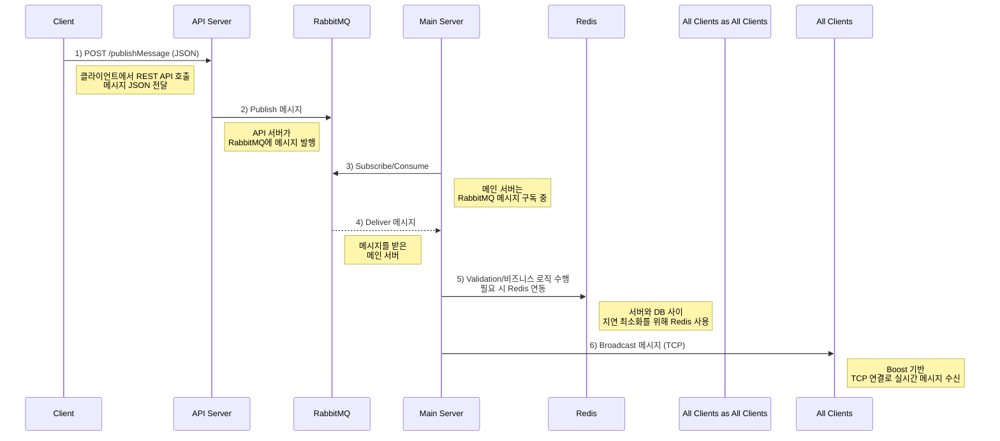
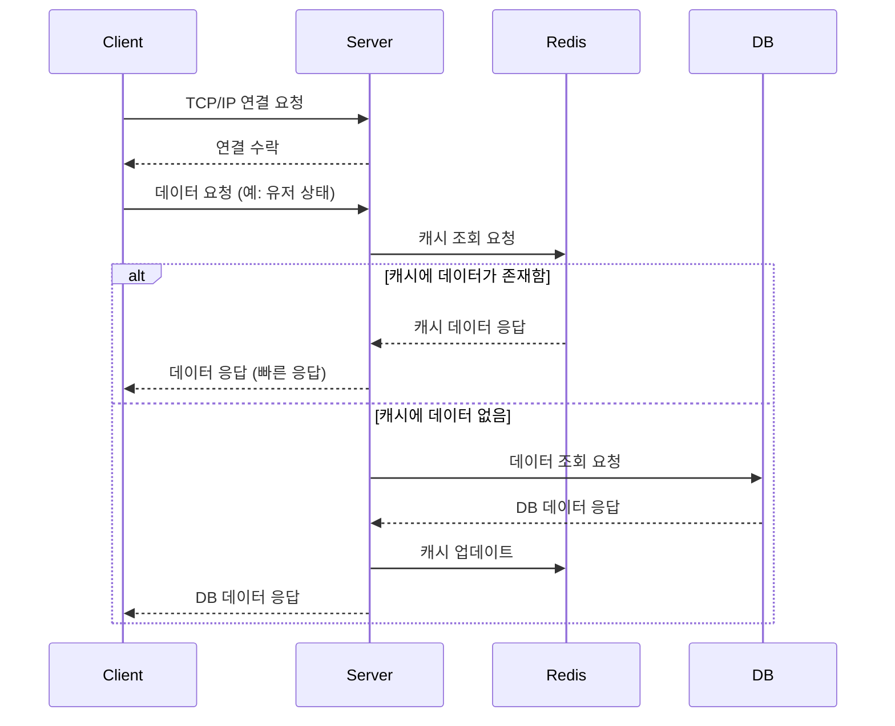
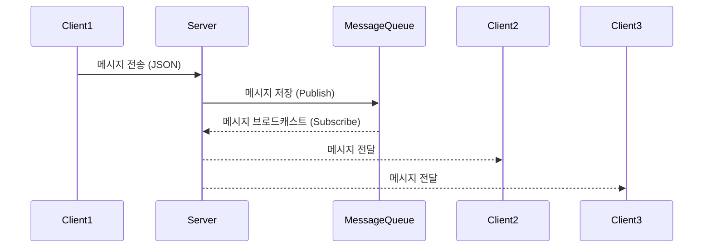
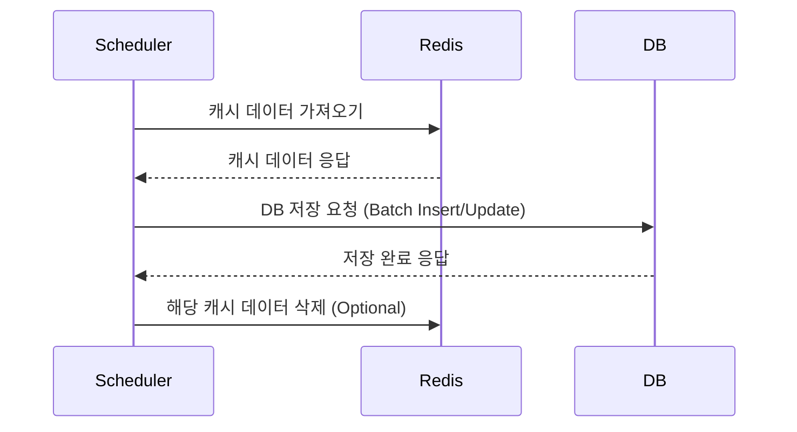
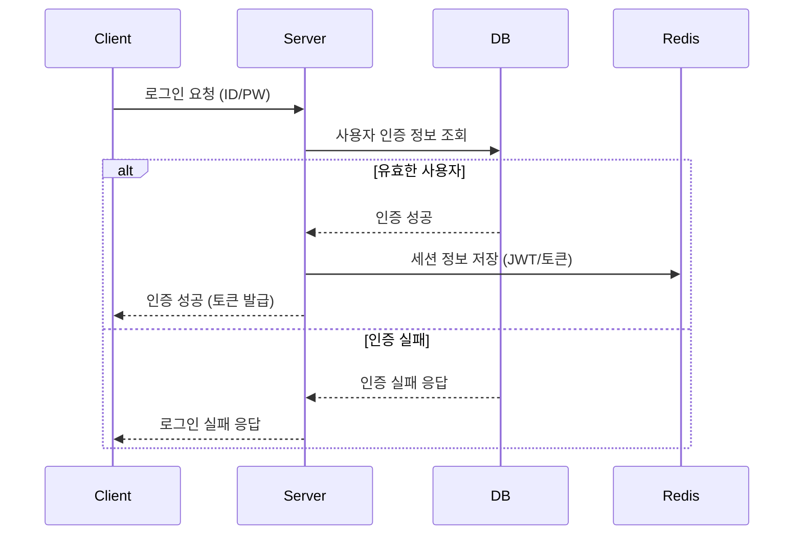
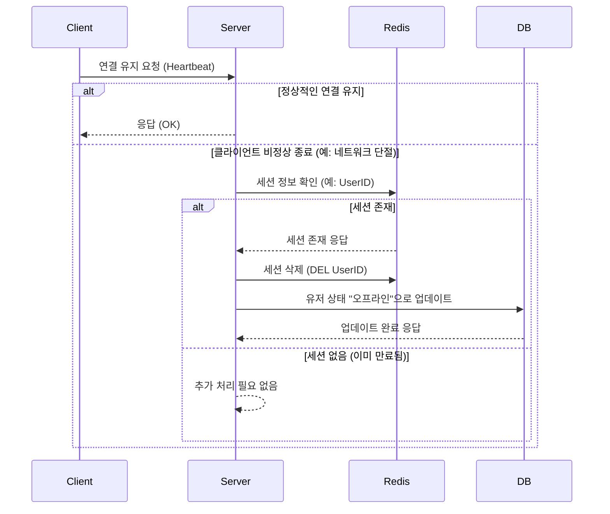

# RealTimeMessageChat
**RealTimeMessageChat**은 다음과 같은 목표와 기술 스택을 통해 **실시간 메시징**을 구현한 프로젝트입니다.

1. **고성능 서버**:
    - **C++17**과 **Boost.Asio**의 `io_context`를 사용해 비동기 I/O를 처리하며, TCP/IP 기반으로 **실시간** 통신을 지원합니다.
2. **메시지 브로커**:
    - *RabbitMQ(AMQP)**를 통해 **API 서버**와 **메인 서버** 간 메시지 발행(Publish)·구독(Consume)을 수행합니다.
3. **데이터베이스 & 캐싱**:
    - **Redis**를 적용하여 서버와 DB 간 지연을 최소화하고, 비즈니스 로직 수행 시 필요한 데이터를 빠르게 검증·처리합니다.
4. **브로드캐스팅**:
    - 메인 서버는 RabbitMQ에서 메시지를 소비한 뒤 검증 및 비즈니스 로직을 수행하고, **모든 클라이언트(메시지를 발행한 클라이언트 포함)**에게 **TCP** 기반으로 메시지를 브로드캐스트합니다.
5. **확장성**:
    - 다중 프로세스·멀티 스레드 아키텍처를 기반으로, 향후 다른 통신 규약이나 도메인 요구사항에도 유연하게 확장할 수 있도록 설계했습니다.
    

이 프로젝트는 **REST API** 요청에 의해 시작된 메시지가 AMQP 메시지 큐를 거쳐, **메인 서버**에서 **검증 및 처리 후 연결된 모든 클라이언트**에게 실시간으로 전달되는 **프로토타입**이자 **기술 시연용**입니다.

## 기본 구성

---
### 클라이언트 접속 및 Redis 데이터 조회

---
### 메시지 큐를 이용한 브로드 캐스트 흐름

---
### Redis → PostgreSQL 데이터 동기화 흐름

---
### 클라이언트↔서버 인증 및 보안 흐름

---
### 비정상 세션 종료 처리 흐름

